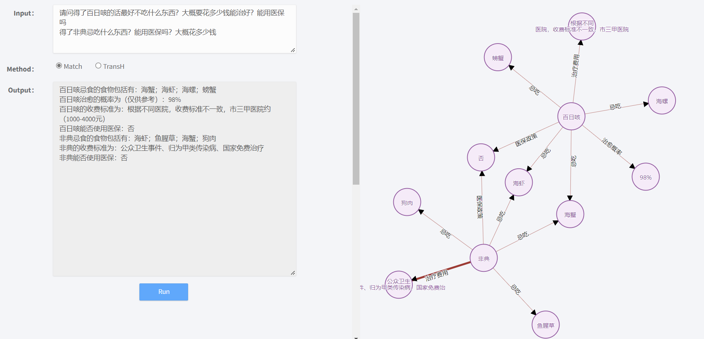
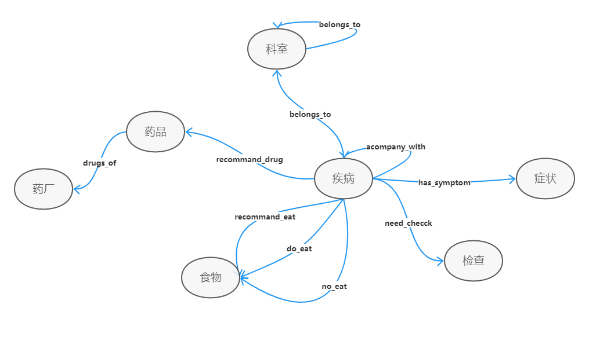

# KB-WEB

本项目是基于医疗领域的知识图谱问答系统。使用Django框架进行与网页端的连接。

# 项目效果

以下两张图是系统是实际运行效果：

# 项目运行方式

运行环境：Python3.8，Django == 2.2.24，torch == 1.10.0，更多详见**requirements.txt**

数据库：neo4j == 3.5.31，MongoDB == 5.0.7

1.启动neo4j数据库，并调整文件**A_byTransH、Match**中的neo4j连接用户名和密码

2.项目目录下使用CMD运行"**python manage.py runserver**"

3.进入127.0.0.1网页，输入问题运行即可

注：知识图谱和问答系统相关代码放在static/uploads/code中，与知识图谱相连的Django框架代码主要是webchat/views.py文件

### 知识图谱和问答系统代码文件说明：

- **爬虫对应代码文件：**

  Spider.py

- **数据构建对应代码文件：**

  Data2Mongo.py

  Cut_Words.py

- **知识存储对应代码文件：**

  Data2Neo4j.py

- **向量表示对应代码文件**：

  TransH.py

- **查询测试对应代码文件**：

  Test.py。

- **问答系统对应代码文件**：

  Q_Class.py

  Q_Parser.py

  Match.py

  A_byMatch.py

  A_byTransH.py
  
- **训练生成的向量、测试集、训练记录、实体映射和关系映射等文件**：

  存放在static/uploads/code/weights_and_files

注：由于接入了Django框架，文件的默认工作路径为项目根目录，有些文件单独运行的话(如训练、测试)可能会导致因为库导入路径不对而出错，需要按相对路径进行修改。

# 医疗知识图谱

数据源：寻医问药网。包括16项信息，其中7类实体，约9千个实体，9类关系，约1.7万实体关系。

**本系统的知识图谱Schema如下：**

**1.1 知识图谱实体类型**

| 实体标签 | 举例                   |
| -------- | ---------------------- |
| 疾病     | 百日咳、非典           |
| 症状     | 高热、畏寒             |
| 检查     | 血压、心电图           |
| 科室     | 妇产科、儿科           |
| 药厂     | 天津生物化学、舒志     |
| 药品     | 摩罗丹、胃肠安丸       |
| 食物     | 番茄黄瓜汁、鸡蛋豆腐汤 |

**1.2 知识图谱实体关系类型**

| 实体关系类型   | 中文含义 | 举例                         |
| -------------- | -------- | ---------------------------- |
| accompany_with | 并发症   | 磷中毒 并发症 肺水肿         |
| belongs_to     | 属于     | 儿童腹痛 属于 消化内科       |
| do_eat         | 可以吃   | 敌鼠中毒 可以吃 葵花子仁     |
| drugs_of       | 生产商是 | 注射用生长抑素 生产商是 康哲 |
| need_check     | 需要检查 | 高血压 需要检查 心电图       |
| no_eat         | 忌吃     | 心绞痛 忌吃 螃蟹             |
| recommend_drug | 推荐药品 | 胆结石 推荐药品 金胆片       |
| recommend_eat  | 推荐吃   | 肺炎 推荐池 酱兔肉           |

**1.3 知识图谱疾病属性**

| 疾病属性        | 中文含义 | 举例                                                         |
| --------------- | -------- | ------------------------------------------------------------ |
| name            | 名称     | 肺气肿                                                       |
| cause           | 原因     | 弹性蛋白酶及其抑制因子失衡                                   |
| cost_money      | 治疗费用 | 根据不同医院，收费标准不一致，市三甲医院约（10000——30000元） |
| cure_department | 治疗科室 | 内科、呼吸内科                                               |
| cure_lasttime   | 治疗时间 | 120天                                                        |
| cure_way        | 治疗方式 | 药物治疗、支持性治疗、手术治疗                               |
| cured_prob      | 治愈率   | 0.5%                                                         |
| desc            | 描述     | 肺气肿是指终末细支气管远端......(省略)                       |
| easy_get        | 易感人群 | 长期接触有机或无机粉尘，有害气体者，吸烟者                   |
| get_prob        | 得病概率 | 0.001%                                                       |
| get_way         | 传播方式 | 无传染性                                                     |
| prevent         | 预防方式 | 1、首先是戒烟。 2、注意保暖，避免受凉，预防感冒。....(省略)  |
| yibao_status    | 医保     | 否                                                           |

# 问题意图分析

基于特征词分类的方法来识别用户查询意图

| 问句类型          |        中文含义        |         问句举例         |
| :---------------- | :--------------------: | :----------------------: |
| disease_symptom   |        疾病症状        |   百日咳的症状有哪些？   |
| symptom_disease   |   已知症状找可能疾病   |   最近老流鼻涕怎么办？   |
| disease_cause     |        疾病病因        |   为什么有的人会失眠？   |
| disease_accompany |      疾病的并发症      |    失眠有哪些并发症？    |
| disease_not_food  |   疾病需要忌口的食物   |    失眠的人不要吃啥？    |
| disease_do_food   |   疾病建议吃什么食物   |      耳鸣了吃点啥？      |
| food_not_disease  | 什么病最好不要吃某事物 |  哪些人最好不好吃蜂蜜？  |
| food_do_disease   |   食物对什么病有好处   |     鹅肉有什么好处？     |
| disease_drug      |      啥病要吃啥药      |      肝病要吃啥药？      |
| drug_disease      |      药品能治啥病      |   板蓝根颗粒能治啥病？   |
| disease_check     |   疾病需要做什么检查   |  脑膜炎怎么才能查出来？  |
| check_disease     |     检查能查什么病     | 全血细胞计数能查出啥来？ |
| disease_prevent   |        预防措施        |    怎样才能预防肾虚？    |
| disease_lasttime  |        治疗周期        |    感冒要多久才能好？    |
| disease_cureway   |        治疗方式        |     高血压要怎么治？     |
| disease_cureprob  |        治愈概率        |     白血病能治好吗？     |
| disease_easyget   |      疾病易感人群      |   什么人容易得高血压？   |
| disease_desc      |        疾病描述        |          糖尿病          |

